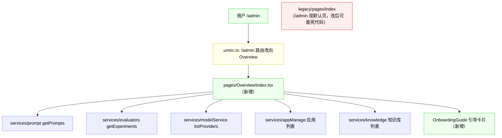
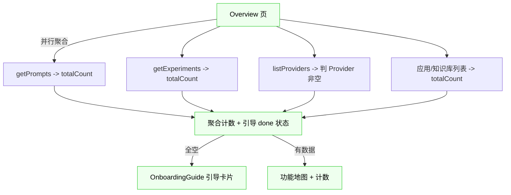

# 影响分析：Overview 总览首页

- 关联需求：[overview.md](overview.md)（D1-D4 已定稿）
- 扫描日期：2026-06-18
- 范围：前端为主（新增页 + 改路由 + 复用现有接口），无后端新代码
- 图例：✅ 现有（复用）｜🆕 新增｜✏️ 修改｜💀 死代码

---

## 1. 一句话结论

- **后端零改动**：复用现有列表接口的 `totalCount`（D1），不新增接口。
- **前端**：新增 Overview 页 + OnboardingGuide 组件，改 `/admin` 落地到 Overview；`legacy/pages/index`（/admin 现默认页）改后可能成死代码。
- **测试**：D1 要求——开发前用基线测试锁住复用接口的返回，改后保证一致。

---

## 2. 链路图

---

## 3. 节点三态表

| # | 状态 | 文件 | 要点 |
|---|---|---|---|
| F1 | 🆕 新增 | `pages/Overview/index.tsx` | Overview 主页：功能地图 + 关键计数 + 条件渲染引导卡片 |
| F2 | 🆕 新增 | `pages/Overview/components/OnboardingGuide.tsx` | 3 步引导卡片（配模型→建 Prompt→建应用），done 状态 + CTA（见需求文档引导卡片样例） |
| F3 | ✏️ 修改 | `.umirc.ts` | `/admin` 落地改向 Overview（redirect 到新路由，或改 `/admin` 默认组件）|
| F4 | ✅ 复用 | `services/prompt` `getPrompts` | Prompt 计数（`totalCount`）|
| F5 | ✅ 复用 | `services/evaluators` `getExperiments` | 评测实验计数（`totalCount`）|
| F6 | ✅ 复用 | `services/modelService` `listProviders` | 引导「模型配置 done」判断（Provider 非空，D4）|
| F7 | ✅ 复用 | `services/appManage`（应用列表） | 应用计数 + 引导「应用 done」判断 |
| F8 | ✅ 复用 | `services/knowledge`（知识库列表） | 知识库计数 |
| F9 | 💀 可能死代码 | `legacy/pages/index.tsx` | `/admin` 现默认页；改 `/admin→overview` 后若仅此处引用则成死代码（grep 确认仅 `.umirc` + `.umi` 自动生成引用）|

> MCP / 组件 / 可观测 / Playground 模块：功能地图**只做入口卡片，不带计数**（无现成计数接口，不强求，已定）。Prompt / 评测 / 应用 / 知识库 / 模型服务带计数。

---

## 4. 数据流图（D1 复用接口聚合）

> 单接口失败（D3）：该卡片计数显示「—」+ 重试按钮，不阻塞其他卡片。

---

## 5. 测试策略（遵循 [docs/testing-guide.md](../testing-guide.md)）

### 5.1 基线测试（D1 要求，必做 —— 开发前锁接口返回）

**目的**：overview 复用现有接口（不改它们），但要在开发前用基线测试锁住这些接口的返回，改后保证一致——防止 overview 改造意外动到后端接口契约（同 `PromptVersionBaselineTest` 思路）。

**覆盖接口**（overview 复用的，锁其列表返回结构 + totalCount）：
- `getPrompts`（Prompt 列表）→ PromptController `/api/prompts`
- `getExperiments`（评测实验）→ 对应 Controller
- `listProviders`（模型 Provider）→ 对应 Controller
- 应用列表、知识库列表接口（精确 Controller 阶段 3 / 实现时锁定）

**做法**：`@SpringBootTest` 连真实库，调这些接口（Controller 层 MockMvc 或 Service 层），序列化返回为基线 JSON，改后对比。参考现有 `PromptVersionBaselineTest`（`@EnabledIfEnvironmentVariable(admin)`、禁 schema-test、`admin` 库真实数据）。

### 5.2 前端手动验证清单（无前端单测体系）
- `/admin` 进入直接到 Overview（落地页 D2）
- 功能地图 9 模块卡片显示 + 计数 + 点击跳转
- 全空数据 → 引导卡片 3 步（done 状态随数据变化）
- 部分完成 → 渐进打勾
- 数据齐全 → 隐藏引导，显示功能地图
- 单接口失败 → 该卡片「—」+ 重试按钮可用
- 移动端响应式（1/2/3-4 列）

### 5.3 CI
- 基线测试 `@EnabledIfEnvironmentVariable(admin)`，CI（admin_test）跳过，不阻塞。

---

## 6. 文档同步清单（CLAUDE.md「文档同步约定」）

| 文档 | 是否改 | 说明 |
|---|---|---|
| `docs/api-list.md` | ✅ 不改 | D1 复用现有接口，无新接口 |
| `docs/README.md` | ⚠️ 可选 | Overview 是新页，可在文档地图提一句（非必须） |
| `CLAUDE.md` | ✅ 不改 | Overview 是 UI 页，非架构变更 |
| `docs/testing-guide.md` | ⚠️ 视情况 | 若基线测试新增了 overview 相关接口锁定，4.3 节可补一行 |
| 本 impact 文档 | ✏️ 改 | 实现后回填实际接口清单 |

---

## 7. 影响范围与风险（阶段 3）

| # | 维度 | 风险 | 等级 | 核实依据 | 缓解 |
|---|---|---|---|---|---|
| 1 | 落地页变更 | `/admin` 改向 Overview，老用户习惯变化 | 🟡 中 | `.umirc.ts` L24-26 `/admin`→legacy/pages/index | `/app` 保留直达；`/admin/*` 子路由不动（只改 `/admin` 默认）|
| 2 | 死代码 | `legacy/pages/index` 改后可能无引用 | 🟢 低 | grep 仅 `.umirc`+`.umi` 引用 | **不清理**（决策：不顺手改范围外代码），标死代码 |
| 3 | 复用接口契约 | overview 依赖 totalCount，改造意外动接口 | 🟢 低 | 现有接口已返回 totalCount | **基线测试锁返回**（D1）|
| 4 | 并行多请求 | 首屏 5+ 并行请求 | 🟢 低 | 前端并行，无阻塞 | 可接受；后续可加聚合接口优化（不在本期）|
| 5 | 单接口失败 | 某模块计数接口失败 | 🟢 低 | D3 已设计 | 显示「—」+ 重试按钮，不阻塞 |
| 6 | 基线测试接口清单 | 应用/知识库列表精确 Controller 待锁定 | 🟡 中 | grep service 文件在，Controller 待对应 | 实现前（基线测试前）锁定精确接口 |
| 7 | 测试覆盖 | 前端为主，无后端逻辑 | 🟢 低 | D1 复用接口，无新后端 | 基线测试 + 前端手动清单 |

**总评**：5 低 + 2 中，无高风险。整体低风险——后端零改、前端新增为主、只动 1 处路由。

---

## 8. 改造步骤与顺序（阶段 3）

> 关键路径：1→2→3→4（原步骤 0 基线测试已取消：后端零改不锁）。**总工作量约 1.2 人天**（前端 + 手动验证）。

| # | 阶段 | 任务 | 做什么 | 前置 | 工作量 | 决策 |
|---|---|---|---|---|---|---|
| ~~0~~ | ~~前置~~ | ~~基线测试~~ | **已取消**：overview 后端零改，无后端改动则不锁基线（用户决策） | — | 0d | — |
| 1 | 前端 | OnboardingGuide 组件 | 3 步引导卡片（参考需求文档样例），done 状态 + CTA | — | 0.3d | 🔗 D4 |
| 2 | 前端 | Overview 页 | 功能地图（带计数/不带计数分组）+ 关键指标 + 条件渲染引导 + 单卡重试（D3）| 1 | 0.5d | 🔗 D3 |
| 3 | 前端 | 路由 | `.umirc.ts`：`/admin` 落地改向 Overview（redirect 或改默认组件），`/app` 保留 | 2 | 0.1d | 🔗 D2 |
| 4 | 验证 | 前端手动 | 按 5.2 清单逐项（落地页/功能地图/引导/失败重试/响应式）| 2,3 | 0.2d | — |
| 5 | 文档 | 可选登记 | README 提一句 overview；testing-guide 若加基线测试则补 | — | 0.1d | — |

**关键决策标注**：D1（复用+基线）、D2（/admin→overview）、D3（失败重试）、D4（Provider 判断）均已在阶段 1 定稿，本阶段无新增 A 组决策。唯一待锁定项：基线测试的精确接口清单（步骤 0 前置）。
