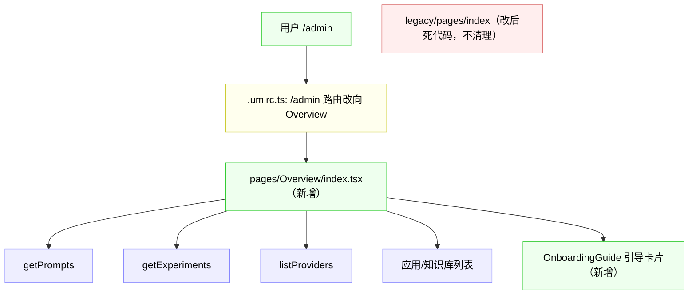
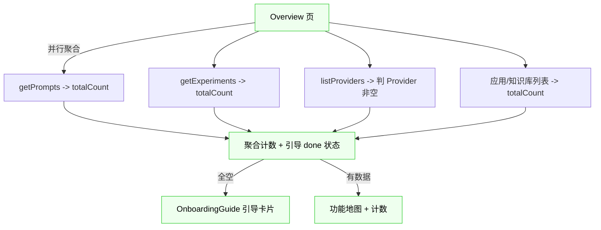

# Overview 总览首页 · 改造方案

> 评审入口，整合自：[需求](overview.md)｜[影响分析](overview-impact.md)。详细推演见这两份。
> 本方案是前端为主改造（后端零改），结构比 prompt-version-diff 简单。

---

## 1. 一句话概要

新增 Overview 总览首页（功能地图 + 关键计数 + 新手引导卡片），`/admin` 落地改向 Overview，**复用现有列表接口的 totalCount（D1，后端零改）**。前端新增为主 + 1 处路由改动。

---

## 2. 涉及链路

**节点摘要**（详见 [impact 第 3 节](overview-impact.md)）：
- 🆕 `pages/Overview/index.tsx` + `OnboardingGuide.tsx`
- ✏️ `.umirc.ts`（`/admin` 路由）
- ✅ 复用 `getPrompts` / `getExperiments` / `listProviders` / 应用列表 / 知识库列表
- 💀 `legacy/pages/index`（改后死代码，**不清理**）

---

## 3. 改造点清单

- 🆕 Overview 页（功能地图：Prompt/评测/应用/知识库/模型服务带计数；MCP/组件/可观测/Playground 只入口卡片）
- 🆕 OnboardingGuide 引导卡片组件（3 步引导，done 状态，参考需求文档样例）
- ✏️ `.umirc.ts`：`/admin` → Overview（redirect 或改默认组件）
- 🆕 基线测试（D1：锁复用接口返回）
- ✅ 后端零改

---

## 4. 改造流程图（数据流）

---

## 5. 影响范围与风险

5 低 + 2 中，无高风险（详见 [impact 第 7 节](overview-impact.md)）。核心：
- 🟡 落地页变更（`/admin`→Overview，但 `/app` 保留、子路由不动）
- 🟡 基线测试接口清单待锁定（步骤 0 前置）
- 其余低（死代码不清理、复用接口契约、并行请求、失败重试）

---

## 6. 改造步骤与顺序

关键路径 0→1→2→3→4，**总约 1.7 人天**（详见 [impact 第 8 节](overview-impact.md)）：

| # | 任务 | 工作量 | 决策 |
|---|---|---|---|
| 0 | **基线测试**（锁复用接口返回）| 0.5d | 🔗 D1 |
| 1 | OnboardingGuide 引导卡片 | 0.3d | 🔗 D4 |
| 2 | Overview 页（功能地图+计数+引导+重试）| 0.5d | 🔗 D3 |
| 3 | 路由 `/admin`→Overview | 0.1d | 🔗 D2 |
| 4 | 前端手动验证 | 0.2d | — |
| 5 | 文档可选登记 | 0.1d | — |

---

## 7. 待审核决策点 ⚠️

### A 组：需拍板 —— **无**

D1-D4 全部在阶段 1 定稿，阶段 3 无新增决策。**唯一待办**（非决策）：基线测试精确接口清单在步骤 0（实现首件事）锁定。

### B 组：已定稿（供复核）

| # | 决策 | 结论 |
|---|---|---|
| D1 | 计数数据来源 | 复用现有列表接口 totalCount；开发前基线测试锁返回，改后保证一致 |
| D2 | 落地页 | `/admin` 进入直接跳 Overview；`/app` 保留直达 |
| D3 | 接口失败 | 显示「—」不阻塞 + 单卡片重试 + 页面可刷新 |
| D4 | 引导「模型配置 done」 | Provider 列表非空 |
| — | 死代码 legacy/pages/index | 不清理（不顺手改范围外代码）|
| — | 功能地图计数范围 | 有计数接口的带（Prompt/评测/应用/知识库/模型），无的只入口（MCP/组件/可观测/Playground）|

---

## 评审结论

4 阶段全部完成，A 组无待拍板项（D1-D4 全定稿）。**方案可直接进入实现阶段**。

实现入口：按步骤 0（基线测试，先锁接口清单）→ 1（OnboardingGuide）→ 2（Overview 页）→ 3（路由）→ 4（验证）。本 skill 职责到此结束，实现用编码流程（plan mode / 直接编码 + 手动验证）。
