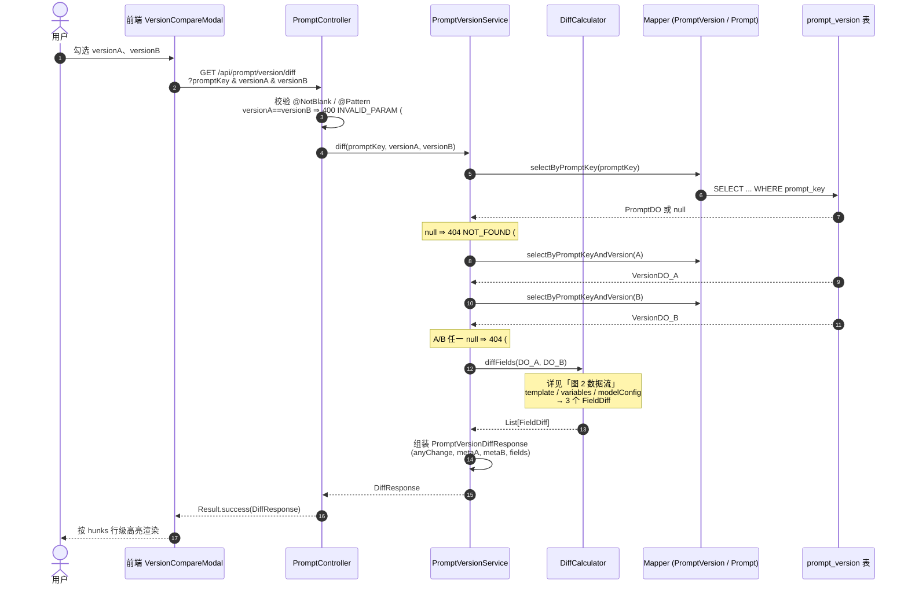
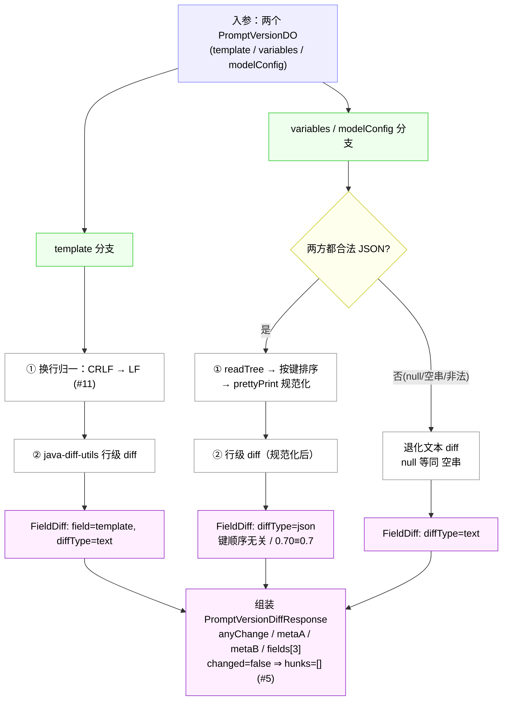
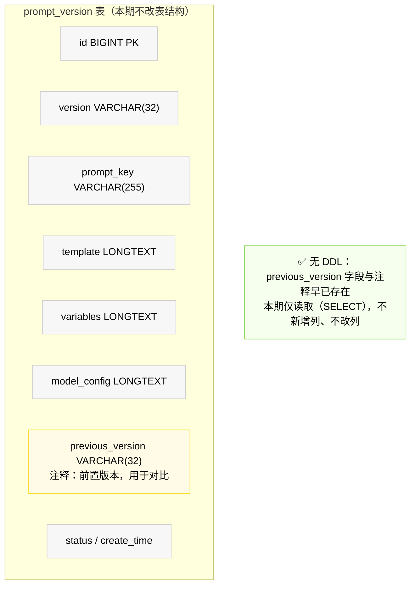

# 改造流程图：Prompt 版本对比（Prompt Version Diff）

- 关联：[需求](prompt-version-diff.md)｜[影响分析](prompt-version-diff-impact.md)
- 本文件含三段 mermaid 源码，并已渲染为同名 `.svg`：
  - 主调用链 → [prompt-version-diff-flow.svg](prompt-version-diff-flow.svg)
  - 数据流 → [prompt-version-diff-dataflow.svg](prompt-version-diff-dataflow.svg)
  - Schema 变更 → [prompt-version-diff-schema.svg](prompt-version-diff-schema.svg)

---

## 图 1：完整调用链（前端发起 → Controller → Service → DAO → 返回）

---

## 图 2：数据流（入参 → FieldDiff → Response）

聚焦 `DiffCalculator` 内部：两个 `PromptVersionDO` 的三个内容字段如何各自变换成 `FieldDiff`，再组装成响应。

---

## 图 3：Schema 变更

> **本需求不改表结构。** `prompt_version` 表的 `previous_version` 字段及其注释（"前置版本，用于对比"）早已存在，本期仅读取，不新增/不修改任何列，无需 DDL。

