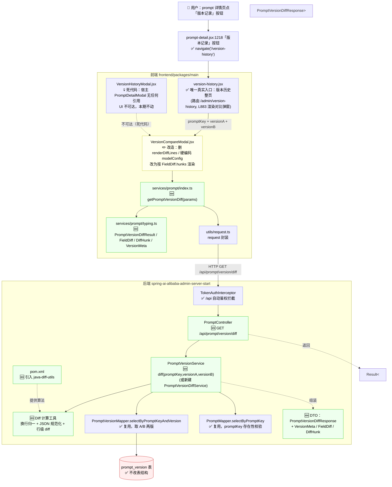

# 影响分析：Prompt 版本对比（Prompt Version Diff）

- 关联需求：[prompt-version-diff.md](prompt-version-diff.md)（接口契约、边界场景已全部定稿）
- 扫描日期：2026-06-16
- 范围：从前端用户操作 → HTTP 入口 → Service → Mapper → DB 的完整链路
- 图例：✅ 现有节点（复用）｜🆕 新增节点｜✏️ 修改节点

---

## 1. 一句话结论

- **DB 无改动**：`prompt_version` 表结构不动（`previous_version` 字段注释已写"用于对比"，早为本需求预留）。
- **后端**：复用 `selectByPromptKeyAndVersion` 取两版数据，新增 1 个 Controller 端点 + 1 个 Service 方法 + 1 套 DTO + 1 个 diff 计算工具 + 1 个 Maven 依赖。
- **前端**：复用两个现有入口（版本历史页 / 历史弹窗）和 `VersionCompareModal` 外壳，**改造组件内部**从"纯前端弱 diff"切换为"调用新接口渲染 `hunks`"，并新增 1 个 service 方法 + 1 套 typing 类型。

---

## 2. 链路图

---

## 3. 后端节点

| # | 状态 | 文件 | 类 / 方法 | 关键逻辑（仅相关） |
|---|---|---|---|---|
| B1 | 🆕 新增 | `controller/PromptController.java` | `getPromptVersionDiff(promptKey, versionA, versionB)` | 在 `@RequestMapping("/api")` 下新增 `@GetMapping("/prompt/version/diff")`，风格对齐现有 `getPromptVersion`（L106）。参数用 `@NotBlank` + `@Pattern`（沿用需求 3.1 正则）做 query 校验；`versionA==versionB` 直接抛 `INVALID_PARAM`（需求 #1）。返回 `Result<PromptVersionDiffResponse>` |
| B2 | 🆕 新增 | `service/PromptVersionService.java`（接口） | `diff(String promptKey, String versionA, String versionB)` | 新增接口方法；或新建独立 `PromptVersionDiffService`（需求实施线索给了两个选项，二选一） |
| B3 | 🆕 新增 | `service/impl/PromptVersionServiceImpl.java`（或新 impl） | `diff(...)` 实现 | ① `promptMapper.selectByPromptKey(promptKey)` 校验 prompt 存在（对齐 `create` L51，需求 #3）；② `promptVersionMapper.selectByPromptKeyAndVersion` 取 A、B 两版，任一为空抛 `NOT_FOUND`（需求 #2，对齐 `getByPromptKeyAndVersion` L149）；③ 委托 diff 工具算三个字段；④ 组装 `PromptVersionDiffResponse` |
| B4 | 🆕 新增 | （新文件）`utils/PromptVersionDiffCalculator.java` 或 service 内私有逻辑 | diff 计算 | 三件事：**(a) 换行归一**——文本 diff 前统一 `\r\n`→`\n`（需求 #11）；**(b) JSON 规范化**——`variables`/`modelConfig` 两方都合法时 `objectMapper.readTree` → 按键排序 → `writerWithDefaultPrettyPrinter`，复用 `template` 同一套行级 diff（需求 #6/#12 分支 2）；至少一方非法/null 时退化文本 diff，`null`≡`""` 归一（分支 1）；**(c) 行级 diff**——调用 java-diff-utils 生成 hunks；changed=false 时 hunks 返回空数组（需求 #5） |
| B5 | 🆕 新增 | `dto/PromptVersionDiffResponse.java` 等 | `PromptVersionDiffResponse` / `VersionMeta` / `FieldDiff` / `DiffHunk` | 风格对齐 `PromptVersionDetail`（`@Data @Builder @NoArgsConstructor @AllArgsConstructor`）。字段见需求 3.2；`anyChange` 只统计 template/variables/modelConfig，不含 createTime |
| B6 | ✅ 复用 | `mapper/PromptVersionMapper.java` + `resources/mapper/PromptVersionMapper.xml` | `selectByPromptKeyAndVersion(promptKey, version)` | 等值查询 `WHERE prompt_key=? AND version=?`，大小写敏感（需求 #10），不校验 status（需求 #9）。**SQL/Mapper 无需改动**，调两次分别取 A、B |
| B7 | ✅ 复用 | `mapper/PromptMapper.java` + `PromptMapper.xml` | `selectByPromptKey(promptKey)` | promptKey 存在性校验（逻辑 FK，SQL 无外键约束） |
| B8 | ✅ 复用 | `entity/PromptVersionDO.java` | — | 字段已含 `template`/`variables`/`modelConfig`/`previousVersion`/`createTime`/`status`，DO 不改 |
| B9 | ✅ 复用 | `runtime/domain/Result.java` | `Result.success(data)` | 成功统一走 `Result.success`；失败由 `StudioException` + 全局异常处理映射 HTTP 码 |
| B10 | ✅ 复用 | `exception/StudioException.java` | 常量 `INVALID_PARAM` / `NOT_FOUND` / `SERVER_ERROR` | 对齐需求 3.3 错误码表；diff 计算异常 catch 后抛 `SERVER_ERROR` |
| B11 | ✅ 复用 | `builder/interceptor/TokenAuthInterceptor.java` + `InterceptorConfig.java` | 鉴权拦截 | `/api/**` 自动生效，diff 接口无需额外配置（复用现有 `TokenAuthInterceptor`） |
| B12 | ✅ 复用（可选） | `utils/ModelConfigParser.java` | `parseModelConfig` / `objectMapper` | JSON 解析与规范化可复用其 `ObjectMapper`；其 `validateModelConfig` 是治本可前置到 `create` 的项，本期接口仅做"解析判断 + 降级"，不强制依赖 |
| B13 | 🆕 新增 | `pom.xml`（`spring-ai-alibaba-admin-server-start`） | 依赖 `io.github.java-diff-utils:java-diff-utils` | 当前 pom **无任何 diff 库**（已核实，grep 无命中），需新增。用于 B4 的行级 diff |

---

## 4. 前端节点

| # | 状态 | 文件 | 函数 / 组件 | 关键逻辑（仅相关） |
|---|---|---|---|---|
| F1 | ✅ 复用 | `legacy/pages/prompts/version-history/version-history.jsx` | **唯一真实入口**（整页） | 用户路径：prompt 详情页「版本记录」按钮（`prompt-detail.jsx:1218`，文案 L1220）→ `navigate('/version-history')` → 本整页（`.umirc.ts` 路由 `/admin/version-history` → legacy `version-history.jsx`）。勾选两个版本（`selectedVersions`，数据来自 `versionDetailsCache`，经 `getPromptVersion` service 取详情，L142）。L883 渲染 `<VersionCompareModal>`。**传参需调整**：现传整个 version 对象，改为传 `promptKey + versionA + versionB`（version 对象里已有 `version` 字段） |
| F2 | 💀 死代码（不动） | `legacy/components/VersionHistoryModal.jsx` + `PromptDetailModal.jsx` | （原"入口②"，弹窗） | `VersionHistoryModal` 由 `PromptDetailModal.jsx:337` 引用，但 **`PromptDetailModal` 全仓无任何引用**（已核实 grep 零结果，挂在 `/admin/prompt-detail` 路由下的是另一个文件 `prompt-detail.jsx`，不是它），整套是 legacy 残留死代码，当前 UI 不可达。**本期无需改动**；如要清理可一并删除两个文件，但不属于本期范围 |
| F3 | ✏️ 修改 | `legacy/components/VersionCompareModal.jsx` | 组件主体 | **核心改造**：① props 改为 `{ promptKey, versionA, versionB, onClose }`；② 删除 `renderDiffLines`（L36–82，按行号硬对齐的假 diff）；③ 删除硬编码的 `modelConfig` 四字段对比（L222–301）；④ `useEffect` 调 `getPromptVersionDiff`，按 `fields[].hunks` 渲染三个字段（template/variables/modelConfig）的行级高亮（复用现有 add/remove/modified 配色 L325–354）；⑤ `metaA`/`metaB` 标量由前端自行对比展示；⑥ loading / error 态 |
| F4 | 🆕 新增 | `legacy/services/prompt/index.ts` | `getPromptVersionDiff(params)` | 风格对齐现有 `getPromptVersion`：`request<PromptAPI.PromptVersionDiffResult>(${API_PATH}/prompt/version/diff, { method:'GET', params })` |
| F5 | 🆕 新增 | `legacy/services/prompt/typing.ts` | `PromptAPI.PromptVersionDiffResult` / `FieldDiff` / `DiffHunk` / `VersionMeta` | 类型与后端 DTO 一一对应（`anyChange`、`metaA/metaB`、`fields[].{field,changed,diffType,hunks[]}`、`hunks[].{type,oldStart,newStart,lines[]}`） |
| F6 | ✅ 复用 | `legacy/utils/request.ts` | `request` | 请求封装，无需改动 |

---

## 5. 文档同步项（CLAUDE.md「文档同步约定」）

| 文档 | 是否改 | 改动 |
|---|---|---|
| `docs/api-list.md` 第 2.2 节 | ✏️ 改 | 现有 5 行（POST/GET `version`、GET `versions`、`template`×2），在 `GET /api/prompt/version` 行后**新增一行**：`GET /api/prompt/version/diff`，Query `promptKey/versionA/versionB`，返回 `Result<PromptVersionDiffResponse>`，一句话说明"对比两个版本"，链接到 requirements（不复制完整 DTO 结构） |
| `docs/data-model.md` 第 18 表 | ✅ 不改 | `prompt_version` 表结构未动；`previous_version` 字段说明**已是"前置版本，用于对比"**（已核实 L410），无需补。仅当实现中发现字段语义需澄清才动 |
| `docs/testing-guide.md` | ⚠️ 视情况 | 本接口不引入新中间件依赖，原则上不改。**但**若为集成测试在 `schema-test.sql` 补了 `prompt`/`prompt_version` 表，需同步更新 4.1 节"测试表含 account/workspace/api_key 三张"那行 |
| `docs/README.md` | ⚠️ 可选 | 文档总入口目前**未收录** `requirements/` 目录；可选登记本需求 + impact 文档（一行链接） |
| 本 impact 文档 | ✏️ 改 | 实现完成后回填实际类名/方法签名、测试类名 |

---

## 6. 测试策略

遵循 [docs/testing-guide.md](../testing-guide.md)。

### 6.1 后端单元测试（不连中间件 —— 核心，必做）

- **目标**：`PromptVersionDiffCalculator`（diff 工具）+ `PromptVersionServiceImpl.diff`（或新 service）
- **手法**：Mockito mock `PromptVersionMapper` / `PromptMapper`，构造两个 `PromptVersionDO` 断言。参考风格 `PromptRunServiceImplTest`（纯 mock，不连中间件）
- **必覆盖用例**：
  - template 行级 diff：增/删/改行 → hunks 的 `type`/`lines` 正确
  - 换行归一（需求 #11）：`\r\n` 与 `\n` 混用不产生伪变更
  - JSON 规范化（需求 #6 分支 2 / #12）：键顺序不同判等、`0.70`≡`0.7` 数值归一
  - 降级（需求 #6 分支 1）：null / 空串 / 非法 JSON 退化文本 diff；`null`≡`""` 归一不产生变更
  - `anyChange`：三字段全同→false；任一变更→true；**createTime 差异不计入**
  - `changed=false` 时 `hunks` 为空数组（需求 #5，不回吐相同内容）
  - `versionA==versionB` 抛 `INVALID_PARAM`（需求 #1）；promptKey/version 不存在抛 `NOT_FOUND`（mock mapper 返回 null）

### 6.2 后端集成测试（连真实 MySQL `admin_test` —— 必做，覆盖契约层）

> 采纳评审反馈：本接口涉及前后端改动，契约层（Controller 参数校验 + 全局异常映射 + 真实 SQL + DTO JSON 序列化 + `Result` 包装）必须由集成测试覆盖，单元 mock 测不到这一层。

- 继承基类 `RealMiddlewareSpringBootTest`，参考 `AuthSpringBootIntegrationTest`（`@SpringBootTest @AutoConfigureMockMvc @ActiveProfiles("test") @Import(TestInfrastructureConfig)`，MockMvc 打 HTTP + JdbcTemplate 塞数据）
- **前置：补 `src/test/resources/schema-test.sql`**——加 `prompt` + `prompt_version` 两张表 DDL（直接复制 `admin-schema.sql` 现成建表语句）+ 同步更新 `docs/testing-guide.md` 4.1 节测试表清单
- 用例：`versionA==versionB`→400；promptKey / version 不存在→404；正常两版→200 且 hunks 正确；DTO 序列化结构正确
- 本接口逻辑**只查 MySQL**、不碰 Redis/RocketMQ（但测试 context 启动仍依赖它们，对齐现有约定）
- diff 算法本身仍由 6.1 单元测试覆盖（更细粒度、CI 必过），两者互补

### 6.3 前端测试（手动验证清单）

- 项目前端**无单元测试体系**（`package.json` 无 test 脚本，无 `.test`/`.spec` 文件），采用手动验证：
  - 版本历史页选两个版本 → 对比弹窗正常加载（loading / 成功 / 失败态）
  - template 行级高亮（增绿 / 删红 / 改黄）正确
  - `variables`、`modelConfig`（含 temperature/topP 之外的动态参数）正确展示差异
  - JSON 键顺序不同的两版**不显示伪变更**
  - `versionA==versionB` / 版本不存在 → 前端错误提示

### 6.4 CI

- push/PR 到 `main` 触发 `.github/workflows/ci.yml` 跑 `mvn test`，CI 用真实 MySQL/Redis/RocketMQ
- 单元测试（mock）在 CI 必过；若 6.2 补了 prompt 表，集成测试也会在 CI 跑

---

## 7. 关键风险与注意

1. **diff 算法库是全新依赖**（B13）：本地已确认可达、不阻塞开发；CI 受限网络或生产部署前需复核，不可达可退化为自实现简易 Myers（需求实施线索已留备选）。
2. **前端只有一个真实入口**（F1）：`VersionCompareModal` 改 props 后，只需同步 `version-history.jsx`（L883）一处调用方。原以为的"入口②"（`VersionHistoryModal`）是死代码（宿主 `PromptDetailModal` 全仓无引用），UI 不可达，无需同步——已在影响分析中修正。
3. **`variables`/`modelConfig` 的 null/非法 JSON 是真实存量**（需求 #6）：根因是 `create` 链路无 JSON 校验（`PromptVersionCreateRequest` 无校验注解、`PromptVersionServiceImpl.create` 裸 String 入库）。本期接口用"降级文本 diff"兜底；治本（把 `ModelConfigParser` 前置到 `create`）是独立项，不在本期但建议跟进。
4. **JSON 规范化的键排序**要稳定：用 `TreeMap`/`ORDER_MAP_ENTRIES_BY_KEYS` 序列化，确保两侧规范化方式完全一致，否则会引入伪差异。
5. **`anyChange` 不含 createTime**：两版创建时刻几乎必然不同，计入会让它恒 true（需求 3.2 注释）。
6. **不截断、不分页**（需求 #8）、**单向 A→B**（需求 #7）：实现时不要画蛇添足加截断逻辑或反向接口。

---

## 8. 改动文件清单（落地核对用）

**后端（5 新增 + 1 改 pom，0 改现有代码）：**
- 🆕 `controller/PromptController.java`（加方法）
- 🆕 `service/PromptVersionService.java`（加方法）或 🆕 `service/PromptVersionDiffService.java` + impl
- 🆕 `dto/PromptVersionDiffResponse.java`、`VersionMeta.java`、`FieldDiff.java`、`DiffHunk.java`
- 🆕 diff 计算工具类（建议 `utils/PromptVersionDiffCalculator.java`）
- 🆕 `pom.xml` 加 `java-diff-utils`
- 🆕 测试（单元：diff 逻辑；集成：400/404 校验）

**前端（2 新增 + 2 改，0 删；另有死代码可选清理）：**
- 🆕 `legacy/services/prompt/index.ts`（加 `getPromptVersionDiff`）
- 🆕 `legacy/services/prompt/typing.ts`（加 diff 类型）
- ✏️ `legacy/components/VersionCompareModal.jsx`（核心改造）
- ✏️ `legacy/pages/prompts/version-history/version-history.jsx`（传参，**唯一调用方**）
- 💀 `legacy/components/VersionHistoryModal.jsx` + `PromptDetailModal.jsx`（死代码，本期不动，可选清理）

---

## 9. 改造步骤与顺序

按依赖关系排序：**后端 → 后端测试 → 前端 → 文档**。工作量按单人估算（含自测），`diff 工具`和`组件改造`是两个最重的点。

### 9.1 关键决策点（先定，再动手）

| 决策 | 结论 | 依据 |
|---|---|---|
| null / 空串 / 非法 JSON 怎么处理 | **已定**：至少一方非合法 → 退化文本 diff，`null`≡`""`；两方合法 → 规范化行级 diff | 需求 #6 / #12 规则块 |
| JSON 规范化方式 | **已定**：`readTree` → 按键排序 → `prettyPrint`，复用 template 行级 diff | 方案 A，需求文档已定 |
| 换行归一 | **已定**：diff 前 `\r\n`→`\n` | 需求 #11 |
| `versionA==versionB` | **已定**：返回 400 | 需求 #1 |
| 是否截断 / 分页 | **已定**：不截断，配套响应体大小监控（用现有 micrometer，零新组件） | 需求 #8 + 风险表 #6 |
| diff 算法库 | **已定：`java-diff-utils`**（前提镜像可达，否则退自实现 Myers） | 风险表 #5 / 决策 D1 |
| Service 形态 | **已定：独立 `PromptVersionDiffService`** | 风险表 #2 / 决策 D3 |
| 集成测试 | **已定：做**（补 `schema-test.sql` 的 prompt 表，覆盖契约层） | 决策 D5 |
| DTO 组织 | `PromptVersionDiffResponse` 内嵌 `VersionMeta`/`FieldDiff`/`DiffHunk` 为静态内部类 | 三者不单独复用，内嵌更紧凑；Lombok `@Data` 风格 |
| Controller 参数校验 | 散参 `@NotBlank`+`@Pattern`，不加 query DTO | 对齐现有 `getPromptVersion` 风格，无分歧 |

### 9.2 步骤序列

| # | 阶段 | 任务 | 做什么 | 前置 | 工作量 | 方案 / 决策 |
|---|---|---|---|---|---|---|
| 1 | 后端 | 引入 diff 库 | `pom.xml` 加 `io.github.java-diff-utils:java-diff-utils`（本地已可达） | — | 0.1d | CI/部署受限网络时复核镜像，拉不到则步骤 3 走方案 B |
| 2 | 后端 | 新建 DTO | `PromptVersionDiffResponse`（含内嵌 `VersionMeta`/`FieldDiff`/`DiffHunk`），`@Data @Builder`，对齐 `PromptVersionDetail`；字段见需求 3.2 | — | 0.2d | DTO 内嵌静态内部类（见决策表） |
| 3 | 后端 | diff 计算工具 | `PromptVersionDiffCalculator`：①换行归一 ②JSON 规范化 ③行级 diff 生成 hunks ④降级分支（null/非法）⑤`changed=false`→空 hunks | 1, 2 | 0.8d | **方案 A java-diff-utils（推荐）**：成熟、支持行级 patch；**方案 B 自实现 Myers**：零依赖，但算法实现与测试成本高。镜像可达则 A |
| 4 | 后端 | Service | 取 A/B 两版（复用 `selectByPromptKeyAndVersion`）、`promptKey` 存在校验、委托工具算 diff、组装 Response | 2, 3 | 0.3d | **方案 A 独立 `PromptVersionDiffService`（推荐）**：零影响 `PromptVersionService` 及 `ExperimentServiceImpl`；**方案 B 加方法到 `PromptVersionService`**：少一个类，但 impl 必须改、耦合上升。选 A |
| 5 | 后端 | Controller 端点 | `PromptController` 加 `@GetMapping("/prompt/version/diff")`，散参 `@NotBlank`+`@Pattern`，`versionA==versionB`→400，委托 service，`Result.success` | 4 | 0.1d | 散参校验，对齐现有风格 |
| 6 | 后端测试 | 单元 + 集成测试 | **单元**（mock mapper）：行级 diff / 换行归一 / JSON 规范化 / 降级 / `anyChange` / 空 hunks；**集成**（MockMvc + 真实 MySQL）：400 / 404 / 200 + DTO 序列化，先在 `schema-test.sql` 补 `prompt`/`prompt_version` 表 | 3, 4, 5 | 1.0d | 集成测试采纳（决策 D5），覆盖契约层；参考 `AuthSpringBootIntegrationTest` |
| 7 | 前端 | typing | `services/prompt/typing.ts` 加 `PromptVersionDiffResult`/`FieldDiff`/`DiffHunk`/`VersionMeta`，与后端 DTO 对齐 | 2（DTO 定稿） | 0.1d | 可与后端并行，DTO 定稿即开工 |
| 8 | 前端 | service 方法 | `services/prompt/index.ts` 加 `getPromptVersionDiff`，对齐 `getPromptVersion` 风格 | 7 | 0.1d | — |
| 9 | 前端 | 改造对比组件 | `VersionCompareModal.jsx`：props 改 `{promptKey,versionA,versionB}`；删 `renderDiffLines`+硬编码 modelConfig；`useEffect` 调 `getPromptVersionDiff`，按 `fields[].hunks` 渲染三字段；加 loading/error 态 | 8 | 0.8d | 复用现有 add/remove/modified 配色；meta 标量前端自比 |
| 10 | 前端 | 入口传参 | `version-history.jsx`（L883）改传 `promptKey+versionA+versionB`（唯一活调用方） | 9 | 0.1d | 死代码 `VersionHistoryModal` 不动 |
| 11 | 前端验证 | 手动验证 | 按测试策略 6.3 清单逐项过（loading/成功/失败、行级高亮、variables/modelConfig 动态参数、键顺序无关、错误态） | 9, 10 | 0.2d | 前端无单测体系 |
| 12 | 文档 | api-list | `docs/api-list.md` 第 2.2 节加一行 `GET /prompt/version/diff` | 5 | 0.1d | — |
| 13 | 文档 | 回填 | 本 impact 文档回填实际类名 / 方法签名 / 测试类名 | 全部完成 | 0.1d | — |

**关键路径**：1→2→3→4→5→6（后端闭环，可独立验收）→ 8→9→10→11（前端）→ 12→13。
**可并行**：步骤 7（前端 typing）在步骤 2（DTO 定稿）后即可开始，不必等后端全部完成，能压缩约 0.5d。
**总工作量**：约 **3.5 人天**（含联调与自测），其中 diff 工具（0.8d）+ 组件改造（0.8d）+ 测试（单元+集成 1.0d）占大头；较初版 +0.5d 为采纳集成测试与监控埋点。

### 9.3 验收检查点

- [ ] 后端：`mvn test` 单元测试全绿（mock，不依赖中间件）
- [ ] 后端：本地起服务，`curl '/api/prompt/version/diff?...'` 三类用例（正常 / 400 / 404）通过
- [ ] 前端：版本历史页选两版，对比弹窗正确渲染行级高亮，`variables` / `modelConfig` 动态参数可见
- [ ] 文档：`api-list.md` 第 2.2 节已加；本 impact 已回填
- [ ] CI：push 后 `.github/workflows/ci.yml` 绿（确认 `java-diff-utils` 镜像可达）
