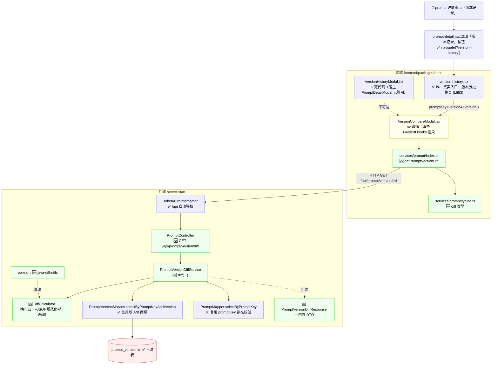
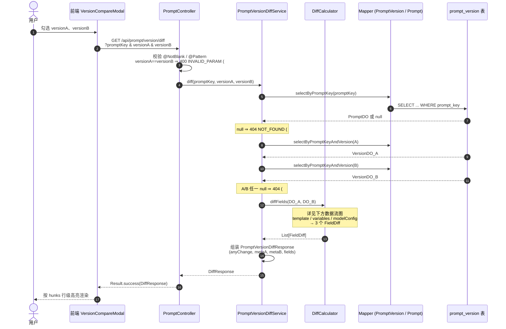
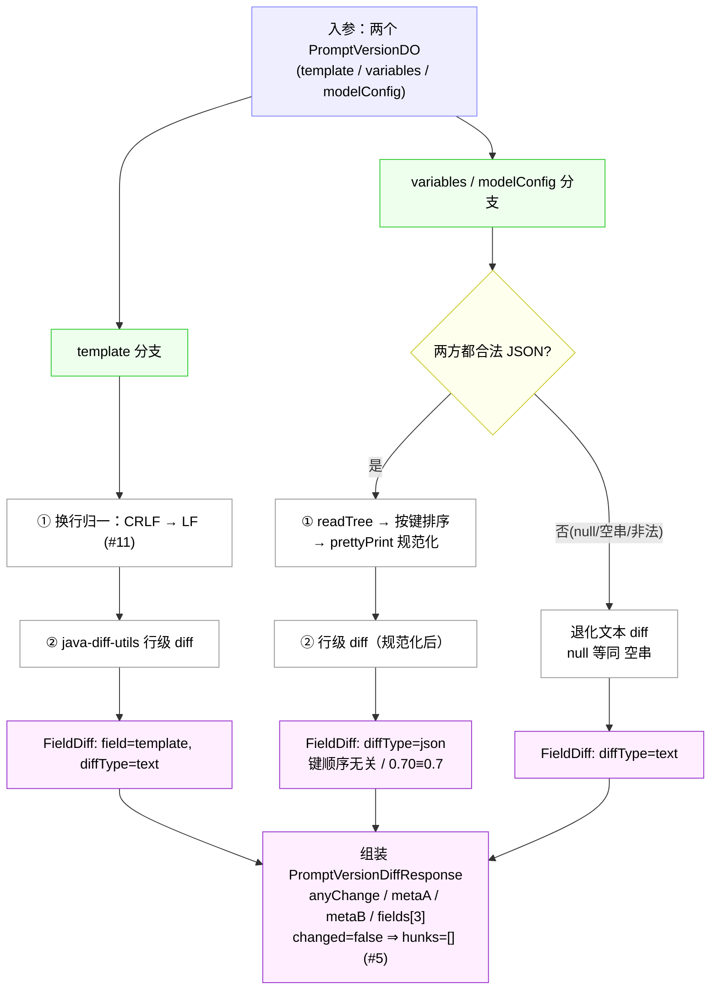

# Prompt 版本对比 · 改造方案

> 本文档是实施与评审的**唯一入口**，整合自：[需求](prompt-version-diff.md)｜[影响分析](prompt-version-diff-impact.md)｜[流程图](prompt-version-diff-flow.md)。
> 详细推演见上述三份文档；本文给出自洽的完整方案。**第 7 节是评审重点**——所有需人拍板的决策集中在一处。

---

## 1. 一句话概要

新增 `GET /api/prompt/version/diff` 接口，对同一 Prompt 的任意两个版本做结构化差异对比（`template` 行级 diff + `variables`/`modelConfig` JSON 规范化 diff），前端把现有 `VersionCompareModal` 从"纯前端弱 diff"切换为消费该接口。**DB 不改表，后端以新增为主（0 改现有代码），前端改造 1 个组件 + 1 处传参。**

---

## 2. 涉及链路

### 2.1 链路图

### 2.2 节点表

**后端**

| # | 状态 | 文件 | 类/方法 | 要点 |
|---|---|---|---|---|
| B1 | 🆕 | `controller/PromptController.java` | `getPromptVersionDiff` | `@GetMapping("/prompt/version/diff")`，散参 `@NotBlank`+`@Pattern`；`versionA==versionB`→400 |
| B2 | 🆕 | `service/PromptVersionDiffService.java`(+impl) | `diff(promptKey,versionA,versionB)` | **独立 service**（不动 `PromptVersionService`） |
| B3 | 🆕 | `utils/PromptVersionDiffCalculator.java` | diff 计算 | 换行归一 + JSON 规范化 + 行级 diff + 降级 + 空 hunks |
| B4 | 🆕 | `dto/PromptVersionDiffResponse.java` | Response + 内嵌 `VersionMeta`/`FieldDiff`/`DiffHunk` | `@Data @Builder`，对齐 `PromptVersionDetail` |
| B5 | 🆕 | `pom.xml` | `java-diff-utils` | 当前无 diff 库，需新增 |
| B6 | ✅ | `PromptVersionMapper`(+xml) | `selectByPromptKeyAndVersion` | 复用，调两次取 A/B；SQL 不改 |
| B7 | ✅ | `PromptMapper`(+xml) | `selectByPromptKey` | 复用，promptKey 存在校验 |
| B8 | ✅ | `entity/PromptVersionDO` / `Result` / `StudioException` / `TokenAuthInterceptor` | — | 全复用，不改 |

**前端**

| # | 状态 | 文件 | 要点 |
|---|---|---|---|
| F1 | ✅ | `legacy/pages/prompts/version-history/version-history.jsx` | 唯一真实入口（L883），传参需调整 |
| F2 | 💀 | `legacy/components/VersionHistoryModal.jsx`+`PromptDetailModal.jsx` | 死代码，不动 |
| F3 | ✏️ | `legacy/components/VersionCompareModal.jsx` | **核心改造**：删 `renderDiffLines`+硬编码 modelConfig，改为消费 hunks |
| F4 | 🆕 | `legacy/services/prompt/index.ts` | 加 `getPromptVersionDiff` |
| F5 | 🆕 | `legacy/services/prompt/typing.ts` | 加 diff 类型 |

---

## 3. 改造点清单

**后端（5 新增 + 改 pom，0 改现有代码）：**
- 🆕 `PromptController` 加方法 / `PromptVersionDiffService`+impl / `PromptVersionDiffCalculator` / `PromptVersionDiffResponse`（含内嵌 DTO）/ `pom.xml` 加 `java-diff-utils`

**前端（2 新增 + 2 改，0 删）：**
- 🆕 `services/prompt/index.ts` / `services/prompt/typing.ts`
- ✏️ `VersionCompareModal.jsx`（核心）/ `version-history.jsx`（传参，唯一调用方）

**测试：**
- 🆕 后端单元测试（mock mapper，覆盖 diff 逻辑 + 400/404），参考 `PromptRunServiceImplTest`
- 可选：集成测试（需先补 `schema-test.sql` 的 prompt 表，性价比低）
- 前端：手动验证清单（无单测体系）

**文档：**
- ✏️ `docs/api-list.md` 第 2.2 节加一行
- ✅ `docs/data-model.md` 不改（`previous_version` 说明已存在）
- ⚠️ `docs/testing-guide.md` 视情况（若补了 schema-test 表才改）
- ✅ `CLAUDE.md` 本改造无需再动

---

## 4. 改造流程图

> 三张图已渲染为 svg：[主调用链](prompt-version-diff-flow.svg)｜[数据流](prompt-version-diff-dataflow.svg)｜[Schema](prompt-version-diff-schema.svg)。源码见 [prompt-version-diff-flow.md](prompt-version-diff-flow.md)。

**主调用链**（前端发起 → Controller → Service → DAO → 返回）：

**数据流**（入参 → FieldDiff → Response，聚焦 DiffCalculator 内部分支）：

**Schema 变更**：✅ **不改表**。`prompt_version.previous_version` 字段及注释（"前置版本，用于对比"）早已存在，本期仅读取，无 DDL。详见 [schema svg](prompt-version-diff-schema.svg)。

---

## 5. 影响范围与风险

| # | 维度 | 风险 | 判断依据 | 缓解 |
|---|---|---|---|---|
| 1 | 现有接口受影响 | 🟢 低 | 新路径独立、Controller 只加不改、新 DTO 不影响现有序列化 | — |
| 2 | 现有调用链（`PromptVersionService` 其他使用方） | 🟢 低 | 仅 `PromptController`/`ExperimentServiceImpl` 两调用方，都不调 diff；**独立 service 则零影响** | 选独立 service |
| 3 | 测试影响 | 🟢 低 | 现有 7 个 server-start 测试无一覆盖 PromptVersion 现有接口；schema-test 不变 | 现有测试无需改 |
| 4 | 文档影响 | 🟢 低 | api-list 加一行；data-model 不改；CLAUDE.md 不动 | — |
| 5 | 前端兼容性（新依赖） | 🟢 低 | 前端零新 npm 依赖；后端 `java-diff-utils` 零传递依赖 | 唯一风险：内网镜像拉不到 → 构建失败（构建期，非运行冲突） |
| 6 | 性能（LONGTEXT 大时网络/序列化） | 🟡 中 | 两次等值查询走索引、序列化线性；**"不截断"留了响应体无上限口子** | 加响应体大小日志/监控；实际 KB 级无压力 |

**总评**：5 低 + 1 中，无高风险。整体低风险，因改造以"新增"为主、几乎"零改现有代码"、DB 不动。

---

## 6. 改造步骤与顺序

> 关键路径：1→2→3→4→5→6（后端闭环）→ 8→9→10→11（前端）→ 12→13。步骤 7（前端 typing）可在步骤 2 后并行，省 ~0.5d。**总工作量约 3 人天**。

| # | 阶段 | 任务 | 做什么 | 前置 | 工作量 | 方案/决策 |
|---|---|---|---|---|---|---|
| 1 | 后端 | 引入 diff 库 | `pom.xml` 加 `java-diff-utils`；先确认内网镜像可达 | — | 0.1d | **🔗 决策 D1/D2** |
| 2 | 后端 | 新建 DTO | `PromptVersionDiffResponse` + 内嵌 `VersionMeta`/`FieldDiff`/`DiffHunk` | — | 0.2d | 内嵌静态内部类 |
| 3 | 后端 | diff 工具 | `PromptVersionDiffCalculator`：换行归一/JSON 规范化/行级 diff/降级/空 hunks | 1,2 | 0.8d | **🔗 决策 D1**（A 库 / B 自实现） |
| 4 | 后端 | Service | 取 A/B + promptKey 校验 + 委托工具 + 组装 | 2,3 | 0.3d | **🔗 决策 D3**（A 独立 / B 加方法） |
| 5 | 后端 | Controller | `@GetMapping("/prompt/version/diff")` + 散参校验 + 400 | 4 | 0.1d | 散参，对齐现有 |
| 6 | 后端测试 | 单元测试 | mock mapper 覆盖 diff 逻辑 + 400/404 | 3,4,5 | 0.5d | **🔗 决策 D5**（集成测试覆盖度） |
| 7 | 前端 | typing | 加 diff 类型 | 2 | 0.1d | 可与后端并行 |
| 8 | 前端 | service | `getPromptVersionDiff` | 7 | 0.1d | — |
| 9 | 前端 | 改造组件 | `VersionCompareModal` 消费 hunks + 删弱 diff | 8 | 0.8d | 复用现有配色 |
| 10 | 前端 | 入口传参 | `version-history.jsx` 改传参 | 9 | 0.1d | 死代码不动 |
| 11 | 前端验证 | 手动验证 | 按测试策略 6.3 清单 | 9,10 | 0.2d | 无单测体系 |
| 12 | 文档 | api-list | 第 2.2 节加一行 | 5 | 0.1d | **🔗 决策 D6**（可选文档登记） |
| 13 | 文档 | 回填 | 本文档回填实际类名 | 全部 | 0.1d | — |

（步骤中 `🔗 决策 Dx` 指向第 7 节对应决策项。）

---

## 7. 待审核的关键决策点 ⚠️

> **评审请聚焦本节。** A 组是需要你拍板的（我已给推荐，请确认或否决）；B 组是前几轮已定稿的（列出供最终复核，确认无误即可）。

### A 组：需要你拍板

| # | 决策 | 选项 | 我的推荐 | 理由 | 影响步骤 |
|---|---|---|---|---|---|
| **D1** | diff 算法实现 | ✅ **已定：`java-diff-utils`**（用户拍板） | 成熟稳定、支持行级 patch；前提是 D2 镜像可达，否则退自实现 Myers | 1, 3 |
| **D2** | `java-diff-utils` 镜像可达性 | ✅ **本地已可达，不阻塞开发**；CI/部署到受限网络前再复核 | 本地开发直接走 D1（java-diff-utils）；仅将来 CI 受限网络或生产部署前需运维复核，不可达再退自实现 Myers | 1, 3, CI |
| **D3** | Service 形态 | ✅ **已定：独立 `PromptVersionDiffService`**（用户拍板） | 零影响现有调用链（`PromptController`/`ExperimentServiceImpl` 都不改） | 4 |
| **D4** | 响应体大小监控 | ✅ **已定：用现有 micrometer，零新组件** | 项目已集成 `actuator` + `micrometer-registry-otlp`（pom L255-267）；在 diff service 注入 `MeterRegistry` 注册自定义 Counter/Gauge，无需引 Prometheus 等 | 3, 5 |
| **D5** | 集成测试 | ✅ **已定：做集成测试**（采纳评审反馈，改判） | 接口涉及前后端，契约层（400/404/200 + DTO 序列化 + 真实 SQL）必须集成覆盖；`schema-test.sql` 补 prompt/prompt_version 表（DDL 现成可复制），成本不高；范本 `AuthSpringBootIntegrationTest` | 6 |
| **D6** | 文档登记 | ✅ **已定：登记 `docs/README.md`，不登记 `external-dependencies.svg`** | `requirements/` 目录应被总入口收录；`java-diff-utils` 是 Maven 库不符合 external-deps（服务/中间件）定位 | 12 |

### B 组：已定稿（供复核，无需再决策）

| # | 决策 | 结论 | 定稿依据 |
|---|---|---|---|
| — | null/空串/非法 JSON | 退化文本 diff（`null`≡`""`）；两方合法走规范化 | 需求 #6 / #12 |
| — | JSON 规范化方式 | 方案 A：`readTree`→按键排序→`prettyPrint` | 需求方案讨论 |
| — | 换行归一 | diff 前 `\r\n`→`\n` | 需求 #11 |
| — | `versionA==versionB` | 返回 400 | 需求 #1 |
| — | 截断/分页 | 不截断、不分页 | 需求 #8 |
| — | diff 方向 | 单向 A→B，不做可逆 | 需求 #7 |
| — | 前端形态 | 改造 `VersionCompareModal` 消费新接口（方案 Y） | 前端讨论 |
| — | 死代码 `VersionHistoryModal`+`PromptDetailModal` | 本期不清理（可选） | 历史包袱记录 |
| — | DTO 组织 | `FieldDiff`/`DiffHunk`/`VersionMeta` 内嵌为静态内部类 | 工程选择 |
| — | Controller 参数校验 | 散参 `@NotBlank`+`@Pattern` | 对齐现有风格 |

### 评审结论（本轮）

- **D1–D6 全部定稿**，可进入实施。
- **D2 不阻塞**：本地开发已确认 `java-diff-utils` 可达；仅在未来 CI 受限网络或生产部署前需运维复核，届时不可达再退自实现 Myers。
- **B 组**（已定稿决策）快速扫一眼确认无遗漏即可。
